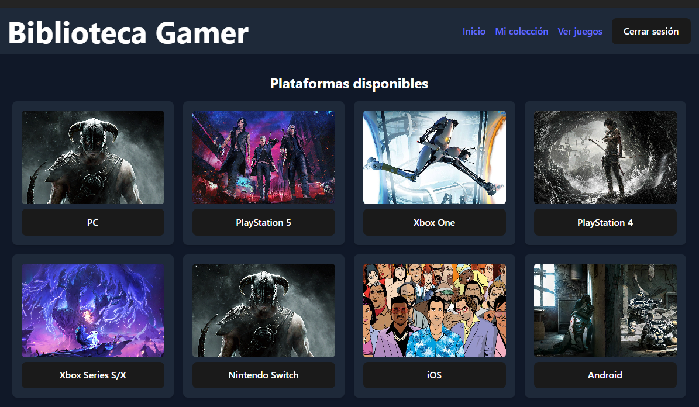
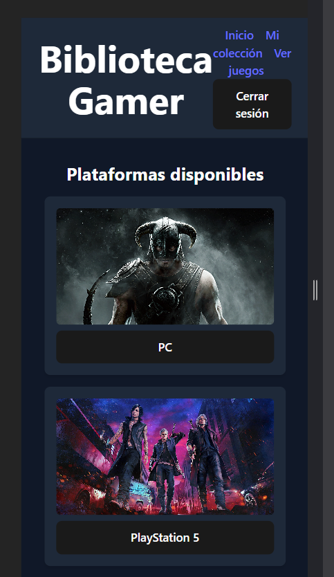
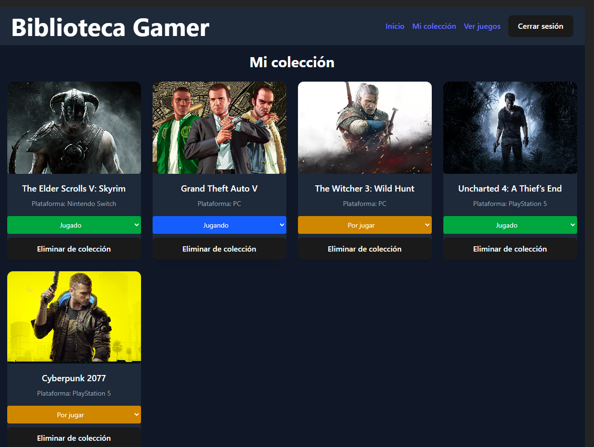
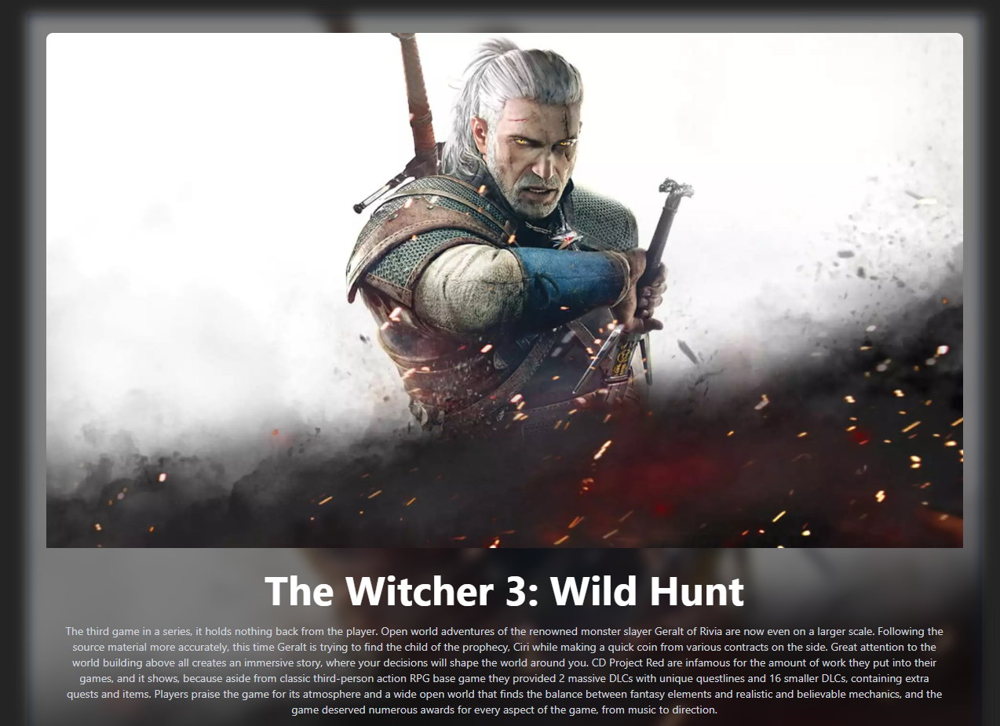

# Proyecto-Final-Code-Space

# Autor: Javier Úbeda Rando 

# GameVerse - Plataforma de Colección de Videojuegos

GameVerse es una aplicación web que te permite explorar, buscar y guardar videojuegos de diferentes plataformas en tu colección personal. Está desarrollada con **React**, **Redux**, **Node.js**, **MongoDB** y utiliza la **API de RAWG** para obtener información actualizada de videojuegos.

---

## Funcionalidades

- Registro e inicio de sesión con autenticación JWT
- Búsqueda de videojuegos por nombre
- Filtro de juegos por género y plataforma
- Añadir y quitar juegos de tu colección
- Cambiar estado del juego: `por jugar`, `jugando`, `jugado`
- Diseño responsive para móvil y escritorio
- Animaciones con Framer Motion para una experiencia más fluida

---

## 📸 Capturas de pantalla

### Inicio (PC y móvil)



### Colección personal


### Detalles del juego


> Asegúrate de que las capturas estén en la carpeta `/screenshots` para que se vean correctamente en GitHub.

---

## Tecnologías utilizadas

**Frontend:**
- React
- React Router
- Redux Toolkit
- Axios
- TailwindCSS
- Framer Motion

**Backend:**
- Node.js
- Express.js
- MongoDB + Mongoose
- JWT (para autenticación)
- dotenv

**API externa:**
- [RAWG Video Games Database API](https://rawg.io/apidocs)

---

## Autenticación

- Registro e inicio de sesión con email y contraseña.
- Los usuarios reciben un token JWT al iniciar sesión.
- El token se almacena en `localStorage` y se usa para acceder a rutas protegidas.

---

## Instalación local

### 1. Clona el repositorio
```bash
git clone https://github.com/Javier-Ubeda/Proyecto-Final-Code-Space


